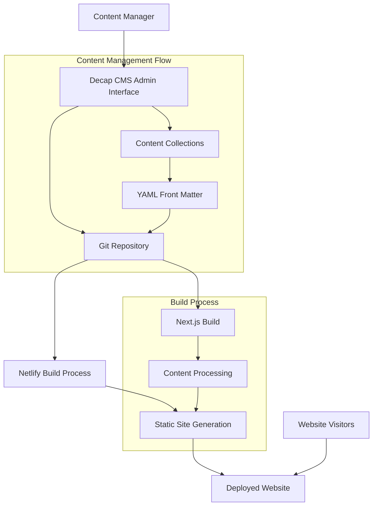

# Design Document

## Overview

This design outlines the transformation of the existing static Next.js website to use Decap CMS (formerly Netlify CMS) for content management. The solution will maintain the exact same visual appearance and functionality while moving all content to be managed through Decap CMS collections. The architecture leverages Decap CMS's Git-based workflow, where content changes are committed to the repository and trigger automatic builds.

## Architecture

### High-Level Architecture



### Content Architecture

The content will be organized into the following Decap CMS collections:

1. **Global Settings** - Site-wide configuration and metadata
2. **Homepage** - Hero section, services overview, testimonials, CTAs
3. **Pages** - About, Contact, and other static pages
4. **Services** - Individual service pages with structured data
5. **Case Studies** - Portfolio items with detailed project information
6. **Insights** - Blog articles and thought leadership content
7. **Media** - Centralized media asset management

## Components and Interfaces

### Decap CMS Configuration

**File: `public/admin/config.yml`**

The main configuration file that defines:
- Backend configuration (Git Gateway for Netlify)
- Media folder structure
- Collection schemas with field definitions
- Editorial workflow settings
- Preview templates

### Content Collections Schema

#### 1. Global Settings Collection
```yaml
name: "settings"
label: "Site Settings"
files:
  - name: "general"
    label: "General Settings"
    fields:
      - {label: "Site Title", name: "siteTitle", widget: "string"}
      - {label: "Site Description", name: "siteDescription", widget: "text"}
      - {label: "Contact Email", name: "contactEmail", widget: "string"}
      - {label: "Phone Number", name: "phone", widget: "string"}
      - {label: "Address", name: "address", widget: "text"}
```

#### 2. Homepage Collection
```yaml
name: "homepage"
label: "Homepage"
fields:
  - label: "Hero Section"
    name: "hero"
    widget: "object"
    fields:
      - {label: "Main Headline", name: "mainHeadline", widget: "string"}
      - {label: "Subheadline", name: "subheadline", widget: "markdown"}
      - {label: "Trust Badge", name: "trustBadge", widget: "string"}
      - label: "Statistics"
        name: "statistics"
        widget: "list"
        fields:
          - {label: "Value", name: "value", widget: "number"}
          - {label: "Suffix", name: "suffix", widget: "string"}
          - {label: "Label", name: "label", widget: "string"}
```

#### 3. Services Collection
```yaml
name: "services"
label: "Services"
folder: "content/services"
create: true
slug: "{{slug}}"
fields:
  - {label: "Title", name: "title", widget: "string"}
  - {label: "Icon", name: "icon", widget: "string"}
  - {label: "Excerpt", name: "excerpt", widget: "text"}
  - {label: "Order", name: "order", widget: "number"}
  - {label: "Timeline", name: "timeline", widget: "string"}
  - {label: "Starting Price", name: "startingPrice", widget: "string", required: false}
  - label: "Features"
    name: "features"
    widget: "list"
    field: {label: "Feature", name: "feature", widget: "string"}
```

#### 4. Case Studies Collection
```yaml
name: "caseStudies"
label: "Case Studies"
folder: "content/case-studies"
create: true
slug: "{{slug}}"
fields:
  - {label: "Title", name: "title", widget: "string"}
  - {label: "Excerpt", name: "excerpt", widget: "text"}
  - {label: "Featured", name: "featured", widget: "boolean", default: false}
  - {label: "Category", name: "category", widget: "select", options: ["web-development", "digital-marketing", "ai-automation"]}
  - {label: "Publish Date", name: "publishDate", widget: "datetime"}
  - label: "Client Information"
    name: "client"
    widget: "object"
    fields:
      - {label: "Name", name: "name", widget: "string"}
      - {label: "Industry", name: "industry", widget: "string"}
      - {label: "Size", name: "size", widget: "string"}
      - {label: "Location", name: "location", widget: "string"}
```

#### 5. Insights Collection
```yaml
name: "insights"
label: "Insights"
folder: "content/insights"
create: true
slug: "{{slug}}"
fields:
  - {label: "Title", name: "title", widget: "string"}
  - {label: "Slug", name: "slug", widget: "string"}
  - {label: "Excerpt", name: "excerpt", widget: "text"}
  - {label: "Content", name: "body", widget: "markdown"}
  - {label: "Featured Image", name: "featuredImage", widget: "image", required: false}
  - {label: "Publish Date", name: "publishDate", widget: "datetime"}
  - {label: "Author", name: "author", widget: "string"}
  - label: "Tags"
    name: "tags"
    widget: "list"
    field: {label: "Tag", name: "tag", widget: "string"}
```

### Content Processing Layer

**File: `src/lib/cms-content.ts`**

A new content processing layer that:
- Reads content from the file system (generated by Decap CMS)
- Provides the same interface as the existing content functions
- Handles content transformation and validation
- Maintains backward compatibility with existing components

```typescript
// New CMS content interface that mirrors existing content.ts
export interface CMSHomepageContent extends HomepageContent {}
export interface CMSServiceData extends ServiceData {}
export interface CMSCaseStudy extends CaseStudy {}

// Functions that replace existing content functions
export function getCMSHomepageContent(): CMSHomepageContent
export function getCMSServiceData(slug: string): Promise<CMSServiceData>
export function getAllCMSServices(): ServiceMeta[]
export function getAllCMSCaseStudies(): CaseStudyMeta[]
```

### Preview System

**File: `public/admin/preview-templates/`**

Custom preview templates that render content using the actual website components:
- `homepage-preview.js` - Preview for homepage content
- `service-preview.js` - Preview for service pages
- `case-study-preview.js` - Preview for case studies
- `insight-preview.js` - Preview for blog articles

## Data Models

### Content File Structure

After CMS integration, the content structure will be:

```
content/
├── settings/
│   └── general.yml
├── pages/
│   ├── homepage.yml
│   ├── about.yml
│   └── contact.yml
├── services/
│   ├── web-development.md
│   ├── digital-marketing.md
│   └── ai-automation.md
├── case-studies/
│   ├── healthcare-clinic-website.md
│   ├── restaurant-chain-marketing.md
│   └── textile-erp-integration.md
└── insights/
    ├── ai-chatbots-customer-service.md
    ├── seo-strategy-local-business.md
    └── [other-articles].md
```

### Media Management

**Media Folder Structure:**
```
public/uploads/
├── services/
├── case-studies/
├── insights/
├── team/
└── general/
```

Media files will be organized by content type and automatically optimized for web delivery.

## Error Handling

### Content Validation

1. **Schema Validation**: Decap CMS enforces field requirements and data types
2. **Build-time Validation**: Custom validation during the build process
3. **Fallback Content**: Default content for missing or invalid data
4. **Error Boundaries**: React error boundaries for graceful degradation

### Build Process Error Handling

1. **Content Parsing Errors**: Detailed error messages for malformed content
2. **Missing Content**: Fallback to default content or skip optional sections
3. **Image Processing**: Fallback images for missing or corrupted media
4. **Deploy Previews**: Netlify deploy previews for testing before going live

### CMS Interface Error Handling

1. **Authentication Errors**: Clear messaging for login issues
2. **Save Conflicts**: Git merge conflict resolution
3. **Network Issues**: Offline editing capabilities where possible
4. **Validation Errors**: Real-time field validation with helpful messages

## Testing Strategy

### Content Migration Testing

1. **Content Parity Testing**: Automated comparison between old and new content
2. **Visual Regression Testing**: Screenshot comparison to ensure identical appearance
3. **Functional Testing**: Verify all interactive elements work correctly
4. **Performance Testing**: Ensure build times and site performance are maintained

### CMS Functionality Testing

1. **CRUD Operations**: Test create, read, update, delete operations for all content types
2. **Workflow Testing**: Test editorial workflow and content approval process
3. **Preview Testing**: Verify preview functionality matches live site
4. **Media Management**: Test image uploads, optimization, and organization

### Integration Testing

1. **Build Process**: Test automated builds triggered by content changes
2. **Deploy Process**: Verify successful deployments after content updates
3. **Git Integration**: Test Git commits and branch management
4. **Authentication**: Test user access and permissions

### User Acceptance Testing

1. **Content Manager Training**: Ensure non-technical users can manage content
2. **Workflow Efficiency**: Measure time to complete common content tasks
3. **Error Recovery**: Test user ability to recover from common mistakes
4. **Documentation**: Verify completeness and clarity of user guides

## Migration Strategy

### Phase 1: Setup and Configuration
- Install and configure Decap CMS
- Create collection schemas
- Set up authentication and permissions
- Configure build process integration

### Phase 2: Content Migration
- Export existing content to CMS format
- Migrate content in batches by content type
- Validate migrated content accuracy
- Test content editing workflows

### Phase 3: Code Integration
- Update content processing functions
- Modify components to use new content structure
- Implement preview templates
- Add error handling and fallbacks

### Phase 4: Testing and Deployment
- Comprehensive testing across all content types
- Performance optimization
- User training and documentation
- Gradual rollout with rollback capability

## Security Considerations

### Authentication and Authorization
- Git Gateway integration for secure authentication
- Role-based access control for different user types
- Secure token management for API access

### Content Security
- Input sanitization for all user-generated content
- XSS prevention in markdown and rich text content
- File upload restrictions and validation

### Infrastructure Security
- HTTPS enforcement for admin interface
- Secure webhook configurations
- Environment variable protection for sensitive data

## Performance Considerations

### Build Performance
- Incremental builds for faster deployment
- Content caching strategies
- Optimized image processing pipeline

### Runtime Performance
- Static site generation maintains current performance
- CDN integration for global content delivery
- Image optimization and lazy loading

### CMS Performance
- Efficient content loading in admin interface
- Optimized preview generation
- Minimal impact on build times