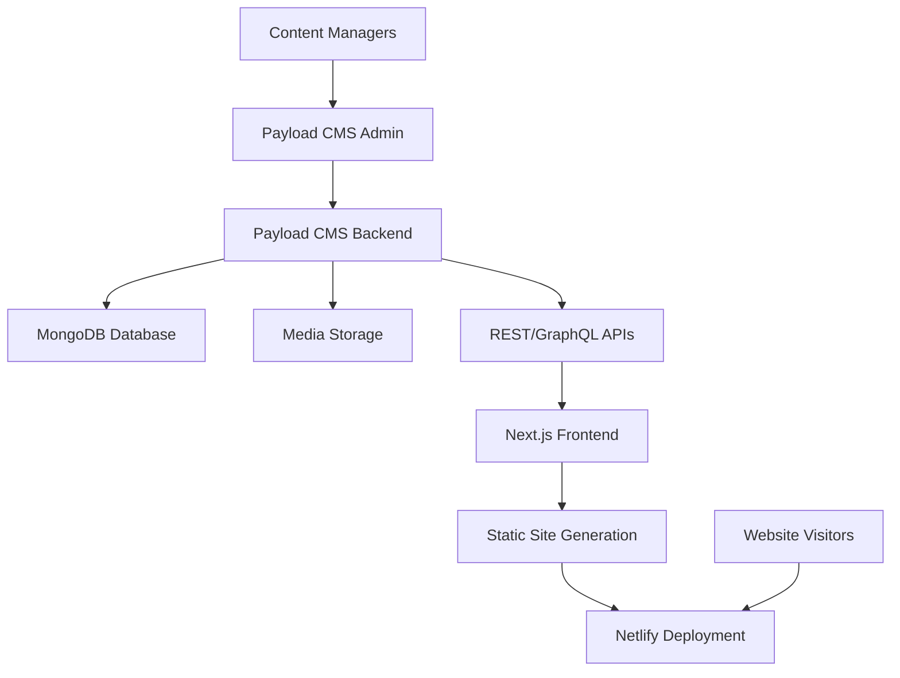

# Design Document

## Overview

This design document outlines the architecture and implementation approach for integrating Payload CMS into the existing Dhimahi Technolabs Next.js website. The solution will transform the current static site into a dynamic, content-managed website while maintaining identical visual appearance and functionality.

The design follows a headless CMS architecture where Payload CMS serves as the content management backend, exposing RESTful and GraphQL APIs that the Next.js frontend will consume. This approach ensures separation of concerns, scalability, and maintains the existing performance characteristics through static site generation.

## Architecture

### High-Level Architecture



### Technology Stack

**Backend (Payload CMS)**
- **Payload CMS 2.x**: Headless CMS with TypeScript support
- **Node.js 18+**: Runtime environment
- **MongoDB**: Primary database for content storage
- **Express.js**: Web framework (built into Payload)
- **Cloudinary/AWS S3**: Media storage and optimization

**Frontend (Next.js)**
- **Next.js 14**: React framework with App Router
- **TypeScript**: Type safety and developer experience
- **Tailwind CSS**: Existing styling framework
- **React**: UI library (existing)

**Deployment & Infrastructure**
- **Payload CMS**: Deployed on Railway/Heroku/DigitalOcean
- **Next.js Frontend**: Deployed on Netlify (existing)
- **Database**: MongoDB Atlas (cloud)
- **Media**: Cloudinary for image optimization

### Data Flow

1. **Content Creation**: Content managers use Payload admin interface
2. **API Exposure**: Payload exposes content via REST/GraphQL APIs
3. **Build Time**: Next.js fetches content during build process
4. **Static Generation**: Pages are pre-rendered with CMS content
5. **Deployment**: Static files deployed to Netlify
6. **Runtime**: Optional ISR for dynamic content updates

## Components and Interfaces

### Payload CMS Collections

#### 1. Homepage Collection (Singleton)
```typescript
interface Homepage {
  hero: {
    mainHeadline: string;
    subheadline: RichText;
    trustBadge: string;
    statistics: Array<{
      value: number;
      suffix: string;
      label: string;
    }>;
    ctaButtons: {
      primary: string;
      secondary: string;
    };
    trustIndicators: string[];
    floatingBadges: Array<{
      icon: string;
      text: string;
    }>;
  };
  servicesSection: {
    title: string;
    subtitle: string;
  };
  whyChooseUs: {
    title: string;
    subtitle: string;
    reasons: Array<{
      icon: string;
      title: string;
      description: string;
    }>;
  };
  testimonials: {
    title: string;
    subtitle: string;
    items: Array<{
      quote: string;
      author: string;
    }>;
  };
  contactCta: {
    title: string;
    description: RichText;
    buttons: {
      primary: string;
      secondary: string;
    };
  };
  contactForm: {
    title: string;
    description: string;
    email: string;
  };
}
```

#### 2. Services Collection
```typescript
interface Service {
  title: string;
  slug: string;
  icon: string;
  excerpt: string;
  order: number;
  timeline: string;
  startingPrice?: string;
  features: string[];
  content: RichText;
  processSteps: Array<{
    step: number;
    title: string;
    description: string;
    duration: string;
    deliverables: string[];
  }>;
  technologyStack: Array<{
    category: string;
    technologies: Array<{
      name: string;
      icon?: string;
      description: string;
    }>;
  }>;
  faqs: Array<{
    question: string;
    answer: string;
  }>;
  seo: {
    metaTitle?: string;
    metaDescription?: string;
    keywords?: string[];
  };
}
```

#### 3. Insights Collection (Blog Posts)
```typescript
interface Insight {
  title: string;
  slug: string;
  excerpt: string;
  content: RichText;
  publishDate: Date;
  author: string;
  category: string;
  tags: string[];
  featuredImage?: Media;
  relatedPosts: Relationship<Insight>[];
  seo: {
    metaTitle?: string;
    metaDescription?: string;
    keywords?: string[];
  };
  status: 'draft' | 'published';
}
```

#### 4. Case Studies Collection
```typescript
interface CaseStudy {
  title: string;
  slug: string;
  excerpt: string;
  client: {
    name: string;
    industry: string;
    size: string;
    location: string;
    website?: string;
  };
  projectType: string;
  duration: string;
  teamSize: number;
  challenge: string;
  solution: string[];
  results: Array<{
    label: string;
    value: string;
    improvement: string;
    timeframe: string;
    icon?: string;
  }>;
  testimonial?: {
    quote: string;
    author: string;
    position: string;
    company: string;
    avatar?: Media;
  };
  images: Array<{
    image: Media;
    alt: string;
    caption?: string;
    type: 'before' | 'after' | 'process' | 'result';
  }>;
  technologies: Array<{
    name: string;
    category: string;
    icon?: string;
  }>;
  services: Relationship<Service>[];
  publishDate: Date;
  featured: boolean;
  content: RichText;
  category: 'web-development' | 'digital-marketing' | 'ai-automation';
}
```

#### 5. About Page Collection (Singleton)
```typescript
interface AboutPage {
  title: string;
  subtitle: string;
  mission: {
    title: string;
    description: RichText;
    vision: string;
  };
  values: Array<{
    icon: string;
    title: string;
    description: string;
  }>;
  timeline: Array<{
    year: string;
    title: string;
    description: string;
  }>;
  team: Array<{
    name: string;
    role: string;
    bio: string;
    expertise: string[];
    image?: Media;
  }>;
}
```

#### 6. Global Settings Collection (Singleton)
```typescript
interface GlobalSettings {
  companyInfo: {
    name: string;
    phone: string;
    email: string;
    address: string;
    cityLine: string;
  };
  socialMedia: {
    facebook?: string;
    twitter?: string;
    linkedin?: string;
    instagram?: string;
  };
  seo: {
    defaultMetaTitle: string;
    defaultMetaDescription: string;
    ogImage?: Media;
  };
  analytics: {
    googleAnalyticsId?: string;
    facebookPixelId?: string;
  };
}
```

### Next.js API Integration

#### Content Fetching Service
```typescript
class PayloadCMSService {
  private baseUrl: string;
  private apiKey: string;

  constructor() {
    this.baseUrl = process.env.PAYLOAD_CMS_URL!;
    this.apiKey = process.env.PAYLOAD_API_KEY!;
  }

  async getHomepage(): Promise<Homepage> {
    // Fetch homepage singleton
  }

  async getAllServices(): Promise<Service[]> {
    // Fetch all services with sorting
  }

  async getServiceBySlug(slug: string): Promise<Service> {
    // Fetch single service by slug
  }

  async getAllInsights(): Promise<Insight[]> {
    // Fetch published insights with pagination
  }

  async getInsightBySlug(slug: string): Promise<Insight> {
    // Fetch single insight by slug
  }

  async getAllCaseStudies(): Promise<CaseStudy[]> {
    // Fetch all case studies
  }

  async getCaseStudyBySlug(slug: string): Promise<CaseStudy> {
    // Fetch single case study by slug
  }

  async getAboutPage(): Promise<AboutPage> {
    // Fetch about page singleton
  }

  async getGlobalSettings(): Promise<GlobalSettings> {
    // Fetch global settings singleton
  }
}
```

## Data Models

### Content Migration Strategy

#### Phase 1: Core Content Types
1. **Global Settings**: Company information, contact details
2. **Homepage**: Hero section, services overview, testimonials
3. **Services**: All service pages with metadata
4. **About Page**: Company story, team, timeline

#### Phase 2: Dynamic Content
1. **Insights**: Blog posts with categories and tags
2. **Case Studies**: Project showcases with results
3. **Media Assets**: Images, documents, videos

#### Phase 3: Advanced Features
1. **SEO Metadata**: Page-specific SEO settings
2. **Form Configurations**: Contact form settings
3. **Navigation Menus**: Dynamic menu management

### Database Schema Design

**Collections Structure:**
- `homepage` (singleton)
- `services` (collection)
- `insights` (collection)
- `case-studies` (collection)
- `about-page` (singleton)
- `global-settings` (singleton)
- `media` (built-in Payload collection)
- `users` (built-in Payload collection)

**Relationships:**
- Case Studies → Services (many-to-many)
- Insights → Related Posts (many-to-many)
- All content → Media (one-to-many)

## Error Handling

### CMS Unavailability
```typescript
// Fallback strategy for CMS downtime
const withFallback = async <T>(
  cmsCall: () => Promise<T>,
  fallbackData?: T
): Promise<T> => {
  try {
    return await cmsCall();
  } catch (error) {
    console.error('CMS Error:', error);
    if (fallbackData) {
      return fallbackData;
    }
    throw new Error('Content unavailable');
  }
};
```

### Content Validation
```typescript
// Runtime content validation
const validateContent = <T>(
  content: unknown,
  schema: z.ZodSchema<T>
): T => {
  try {
    return schema.parse(content);
  } catch (error) {
    console.error('Content validation failed:', error);
    throw new Error('Invalid content structure');
  }
};
```

### Graceful Degradation
- **Missing Images**: Show placeholder images
- **Missing Content**: Display default content
- **API Errors**: Show cached content or error messages
- **Build Failures**: Fallback to last successful build

## Testing Strategy

### Unit Testing
- **Content Fetching**: Test API service methods
- **Data Transformation**: Test content mapping functions
- **Component Rendering**: Test React components with CMS data
- **Validation**: Test content validation schemas

### Integration Testing
- **CMS API**: Test Payload CMS endpoints
- **Build Process**: Test static generation with CMS data
- **Form Submissions**: Test contact forms with CMS integration
- **Media Handling**: Test image optimization and delivery

### End-to-End Testing
- **Content Management**: Test admin interface workflows
- **Content Display**: Test frontend rendering of CMS content
- **Performance**: Test page load times with CMS data
- **SEO**: Test meta tags and structured data

### Content Testing
- **Migration Accuracy**: Verify all content migrated correctly
- **Content Relationships**: Test related content functionality
- **Media Assets**: Verify all images and files work correctly
- **Responsive Design**: Test content display across devices

### Performance Testing
- **Build Times**: Measure static generation performance
- **API Response Times**: Test CMS API performance
- **Page Load Speed**: Verify frontend performance maintained
- **Image Optimization**: Test media delivery performance

## Security Considerations

### Authentication & Authorization
- **Admin Access**: Role-based access control for content managers
- **API Security**: API key authentication for frontend requests
- **Content Permissions**: Granular permissions for different content types
- **Session Management**: Secure admin session handling

### Data Protection
- **Input Validation**: Sanitize all content inputs
- **XSS Prevention**: Escape user-generated content
- **CSRF Protection**: Implement CSRF tokens for admin forms
- **Rate Limiting**: Prevent API abuse

### Infrastructure Security
- **HTTPS**: Enforce SSL/TLS for all communications
- **Database Security**: Secure MongoDB connection strings
- **Environment Variables**: Secure storage of sensitive configuration
- **Backup Strategy**: Regular automated backups

## Performance Optimization

### Static Site Generation
- **Build-time Fetching**: Fetch all content during build process
- **Incremental Static Regeneration**: Update specific pages when content changes
- **Edge Caching**: Leverage CDN for static assets
- **Image Optimization**: Automatic image resizing and format conversion

### Content Delivery
- **API Caching**: Cache CMS responses for faster builds
- **Media CDN**: Use Cloudinary or similar for optimized media delivery
- **Lazy Loading**: Implement lazy loading for images and heavy content
- **Bundle Optimization**: Code splitting and tree shaking

### Database Optimization
- **Indexing**: Proper database indexes for common queries
- **Query Optimization**: Efficient data fetching strategies
- **Connection Pooling**: Optimize database connections
- **Content Compression**: Compress large content fields

This design ensures a seamless transition from the current static site to a fully content-managed solution while maintaining all existing functionality and performance characteristics.