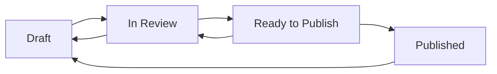

# Content Workflow and Approval Processes

## Table of Contents
1. [Workflow Overview](#workflow-overview)
2. [Content Lifecycle](#content-lifecycle)
3. [Roles and Permissions](#roles-and-permissions)
4. [Editorial Workflow](#editorial-workflow)
5. [Content Review Process](#content-review-process)
6. [Publishing Guidelines](#publishing-guidelines)
7. [Quality Assurance](#quality-assurance)
8. [Emergency Procedures](#emergency-procedures)

## Workflow Overview

The content management workflow ensures that all website content maintains high quality standards and follows consistent processes from creation to publication.

### Key Principles

- **Quality First**: All content must meet quality standards before publication
- **Collaborative Review**: Multiple eyes on content before it goes live
- **Version Control**: All changes are tracked and reversible
- **Consistent Standards**: Uniform style and formatting across all content
- **Timely Updates**: Efficient processes that don't delay important updates

### Workflow Stages



## Content Lifecycle

### 1. Content Planning

**Before creating content:**
- Define content objectives and target audience
- Research keywords and topics
- Plan content structure and key messages
- Gather necessary assets (images, data, quotes)
- Set publication timeline

**Planning Checklist:**
- [ ] Content purpose clearly defined
- [ ] Target audience identified
- [ ] Keywords researched
- [ ] Assets gathered
- [ ] Timeline established

### 2. Content Creation

**During content creation:**
- Follow brand guidelines and style guide
- Use approved templates and formats
- Include all required metadata
- Optimize for SEO and accessibility
- Add appropriate tags and categories

**Creation Checklist:**
- [ ] Content follows brand guidelines
- [ ] All required fields completed
- [ ] Images optimized and have alt text
- [ ] SEO metadata included
- [ ] Proper formatting applied

### 3. Content Review

**Review process includes:**
- Editorial review for accuracy and clarity
- Brand compliance check
- Technical review for functionality
- SEO optimization review
- Accessibility compliance check

**Review Checklist:**
- [ ] Content is accurate and up-to-date
- [ ] Grammar and spelling checked
- [ ] Brand voice and tone consistent
- [ ] Links work correctly
- [ ] Images display properly
- [ ] Mobile-friendly formatting

### 4. Content Publication

**Before publishing:**
- Final approval from designated reviewer
- Scheduling for optimal timing
- Social media and marketing coordination
- Backup verification
- Performance monitoring setup

**Publication Checklist:**
- [ ] Final approval received
- [ ] Publication timing optimized
- [ ] Marketing team notified
- [ ] Monitoring tools configured
- [ ] Rollback plan ready

## Roles and Permissions

### Content Creator
**Responsibilities:**
- Create and edit draft content
- Upload and organize media assets
- Follow content guidelines and standards
- Submit content for review

**Permissions:**
- Create new content entries
- Edit own draft content
- Upload media files
- Save content as drafts

### Content Reviewer/Editor
**Responsibilities:**
- Review content for quality and accuracy
- Ensure brand compliance
- Provide feedback and suggestions
- Approve content for publication

**Permissions:**
- Edit all content types
- Change content status
- Approve content for publication
- Manage media library

### Content Manager/Administrator
**Responsibilities:**
- Oversee entire content workflow
- Manage user permissions
- Configure CMS settings
- Handle emergency content updates

**Permissions:**
- Full access to all content
- User management capabilities
- CMS configuration access
- Direct publishing rights

### Technical Administrator
**Responsibilities:**
- CMS technical configuration
- Troubleshoot technical issues
- Manage integrations and builds
- Monitor system performance

**Permissions:**
- Full system access
- Configuration management
- User account management
- Build and deployment control

## Editorial Workflow

### Standard Workflow Process

#### Step 1: Draft Creation
- Content creator writes initial draft
- All required fields must be completed
- Content saved in "Draft" status
- Creator can make unlimited revisions

#### Step 2: Review Submission
- Creator changes status to "In Review"
- Automatic notification sent to reviewers
- Content locked from creator edits
- Review process begins

#### Step 3: Review Process
- Reviewer evaluates content against standards
- Feedback provided through comments
- Status changed to "Ready" if approved
- Status returned to "Draft" if changes needed

#### Step 4: Publication
- Approved content moved to "Ready to Publish"
- Final publication timing determined
- Content published to live site
- Status updated to "Published"

### Workflow Notifications

**Email Notifications Sent For:**
- Content submitted for review
- Review completed with feedback
- Content approved for publication
- Content published successfully
- Workflow errors or issues

### Workflow Timelines

**Standard Content:**
- Review Period: 2-3 business days
- Revision Period: 1-2 business days
- Publication: Within 24 hours of approval

**Urgent Content:**
- Review Period: Same day
- Revision Period: 2-4 hours
- Publication: Immediate upon approval

**Scheduled Content:**
- Review Period: 1 week before publication
- Revision Period: 3-5 business days
- Publication: As scheduled

## Content Review Process

### Review Criteria

#### Editorial Review
**Content Quality:**
- Clear, engaging, and informative
- Appropriate tone and voice
- Proper grammar and spelling
- Logical structure and flow

**Brand Compliance:**
- Consistent with brand guidelines
- Appropriate messaging and positioning
- Correct use of brand assets
- Aligned with company values

#### Technical Review
**Functionality:**
- All links work correctly
- Images display properly
- Forms function as expected
- Mobile responsiveness verified

**SEO Optimization:**
- Appropriate keywords included
- Meta descriptions optimized
- Headers properly structured
- Alt text for all images

#### Legal and Compliance Review
**Content Accuracy:**
- Facts and figures verified
- Legal disclaimers included
- Compliance with regulations
- Copyright and licensing cleared

### Review Documentation

**Review Form Template:**

```
Content Title: _______________
Reviewer: _______________
Review Date: _______________

Editorial Review:
□ Content quality meets standards
□ Brand voice and tone appropriate
□ Grammar and spelling correct
□ Structure and flow logical

Technical Review:
□ All links functional
□ Images display correctly
□ Mobile-friendly formatting
□ SEO elements optimized

Compliance Review:
□ Information accurate and current
□ Legal requirements met
□ Copyright cleared
□ Accessibility standards met

Overall Assessment:
□ Approve for publication
□ Approve with minor changes
□ Requires major revisions
□ Reject - does not meet standards

Comments and Feedback:
_________________________________
_________________________________

Reviewer Signature: _______________
```

## Publishing Guidelines

### Publication Timing

**Best Times to Publish:**
- **Blog Articles**: Tuesday-Thursday, 10 AM - 2 PM
- **Service Updates**: Monday mornings
- **Case Studies**: Wednesday-Friday
- **Company News**: Tuesday-Thursday

**Avoid Publishing:**
- Late Friday afternoons
- Weekends (unless urgent)
- Major holidays
- During known system maintenance

### Pre-Publication Checklist

**Content Verification:**
- [ ] All content reviewed and approved
- [ ] Images optimized and properly sized
- [ ] Links tested and functional
- [ ] SEO metadata complete
- [ ] Mobile formatting verified

**Technical Verification:**
- [ ] Build process tested
- [ ] No conflicts with existing content
- [ ] Backup systems verified
- [ ] Monitoring tools configured

**Communication:**
- [ ] Stakeholders notified
- [ ] Marketing team informed
- [ ] Social media scheduled
- [ ] Internal announcements prepared

### Post-Publication Process

**Immediate Actions (0-2 hours):**
- Verify content appears correctly on live site
- Test all functionality and links
- Monitor for any error messages
- Check mobile and desktop versions

**Short-term Actions (2-24 hours):**
- Monitor website analytics
- Check for user feedback or issues
- Verify search engine indexing
- Update internal documentation

**Long-term Actions (1-7 days):**
- Analyze content performance
- Gather user feedback
- Plan follow-up content
- Document lessons learned

## Quality Assurance

### Content Standards

**Writing Standards:**
- Clear, concise, and engaging prose
- Active voice preferred over passive
- Consistent terminology and style
- Appropriate reading level for audience

**Visual Standards:**
- High-quality, professional images
- Consistent image sizing and formatting
- Proper alt text for accessibility
- Brand-compliant visual elements

**Technical Standards:**
- Fast loading times
- Mobile-responsive design
- Accessible to users with disabilities
- SEO-optimized structure

### Quality Control Measures

**Automated Checks:**
- Spell check and grammar validation
- Link verification
- Image optimization verification
- SEO score assessment

**Manual Reviews:**
- Editorial review by qualified staff
- Brand compliance verification
- User experience testing
- Accessibility audit

### Performance Monitoring

**Key Metrics to Track:**
- Page load times
- User engagement metrics
- Search engine rankings
- Conversion rates
- Error rates and issues

**Regular Audits:**
- Monthly content quality review
- Quarterly SEO performance audit
- Semi-annual accessibility compliance check
- Annual workflow process review

## Emergency Procedures

### Urgent Content Updates

**When to Use Emergency Process:**
- Critical business information changes
- Legal or compliance requirements
- Security-related updates
- Error corrections affecting user experience

**Emergency Workflow:**
1. Content creator identifies urgent need
2. Immediate notification to content manager
3. Expedited review process (2-4 hours)
4. Direct publication with post-publication review
5. Documentation of emergency process use

### Content Rollback Procedures

**When Rollback is Needed:**
- Published content contains errors
- Technical issues caused by new content
- Legal or compliance concerns arise
- Negative user impact identified

**Rollback Process:**
1. Identify problematic content
2. Notify content manager immediately
3. Revert to previous version via Git
4. Trigger emergency build
5. Verify rollback successful
6. Document incident and resolution

### Crisis Communication

**Internal Communication:**
- Immediate notification to content team
- Status updates every 30 minutes
- Resolution confirmation to all stakeholders
- Post-incident review meeting scheduled

**External Communication:**
- User notification if service affected
- Social media updates if appropriate
- Customer support team briefing
- Public statement if necessary

### Contact Information

**Emergency Contacts:**
- Content Manager: [contact info]
- Technical Administrator: [contact info]
- Legal Team: [contact info]
- Executive Team: [contact info]

**Escalation Path:**
1. Content Creator → Content Reviewer
2. Content Reviewer → Content Manager
3. Content Manager → Technical Administrator
4. Technical Administrator → Executive Team

---

*This workflow guide should be reviewed and updated quarterly to ensure it remains current with business needs and technical capabilities.*